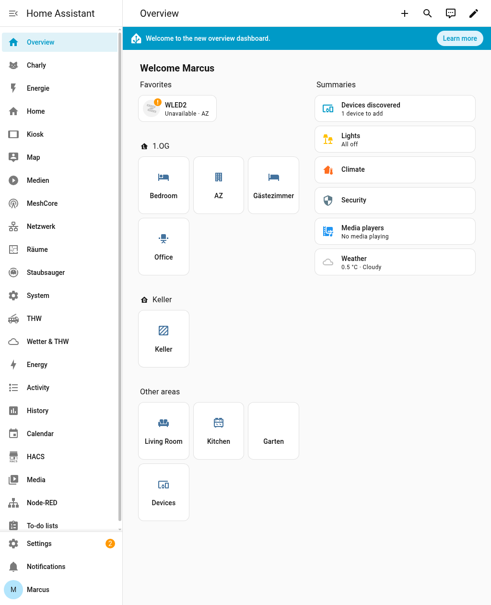
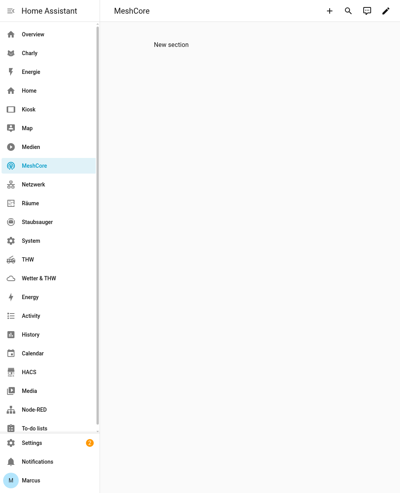

# MeshCore Nachrichten - Benutzerhandbuch

> **Fuer die Familie**: So erreichst du Marcus unterwegs ueber das Galaxy Tab.

---

## Was ist das?

Marcus hat ein tragbares Funkgeraet (**T-Deck**) dabei, das ueber LoRa-Funk Nachrichten senden und empfangen kann - auch ohne Internet oder Handynetz. Ueber das Galaxy Tab zu Hause kannst du ihm Nachrichten schicken und seine Antworten lesen.

```
 Galaxy Tab                    T-Beam                      T-Deck
 (zu Hause)  ---WiFi--->  (Funk-Gateway)  ~~~LoRa~~~>  (bei Marcus)
     |                     im Haus/Balkon               bis zu 10 km
     |                          |
     +--- Home Assistant -------+
          (Smart Home Server)
```

---

## Nachricht an Marcus senden

### Schritt 1: Dashboard oeffnen

Oeffne auf dem Galaxy Tab den Browser und gehe zu:

```
http://192.168.178.108:8123
```

Falls du eingeloggt bist, siehst du das Home Assistant Dashboard. Tippe in der Seitenleiste auf **MeshCore** (Symbol: Funkturm).



### Schritt 2: Empfaenger waehlen

Du siehst das MeshCore Messenger-Fenster:



**Fuer eine Nachricht direkt an Marcus:**

1. Tippe auf **Empfaenger-Typ** und waehle **Contact**
2. Tippe auf **Kontakt** und waehle **IceDeck**
3. Tippe in das Feld **Nachricht** und schreibe deine Nachricht
4. Tippe auf den Button **Nachricht senden**

**Fuer eine Nachricht an alle im Mesh (oeffentlich):**

1. Tippe auf **Empfaenger-Typ** und waehle **Channel**
2. Tippe auf **Kanal** und waehle **Public (0)**
3. Schreibe die Nachricht
4. Tippe auf **Nachricht senden**

### Schritt 3: Warten auf Antwort

Wenn Marcus antwortet, erscheint eine **Benachrichtigung** oben im Home Assistant Dashboard.

> **Hinweis**: Nachrichten koennen einige Sekunden brauchen, da sie ueber Funk uebertragen werden.

---

## Wichtige Hinweise

### Wann funktioniert es?

- **T-Beam muss laufen**: Das kleine Geraet mit Antenne (im Haus) muss eingeschaltet und am Strom sein
- **Reichweite**: Funktioniert bis ca. **2-5 km in der Stadt** und **5-10 km auf dem Land**
- **Kein Internet noetig**: Die Nachrichten gehen direkt ueber Funk (LoRa), nicht ueber das Internet

### Wann funktioniert es NICHT?

- T-Beam ist ausgeschaltet oder ohne Strom
- Marcus ist zu weit weg (ausserhalb der LoRa-Reichweite)
- Galaxy Tab ist nicht im WLAN

### Statusanzeige

Auf der rechten Seite des Dashboards siehst du den Status (siehe rechte Seite im Screenshot oben).

- **Status: online** = Alles OK, Gateway ist bereit
- **Status: offline** = T-Beam ist nicht erreichbar (Strom pruefen!)
- **Batterie**: Wenn der T-Beam an USB haengt, ist das egal. Wichtig nur bei Akkubetrieb.

---

## Schnellreferenz

| Was | Wie |
|-----|-----|
| Dashboard oeffnen | Browser -> `http://192.168.178.108:8123` -> MeshCore |
| Nachricht an Marcus | Empfaenger: **Contact** -> **IceDeck** -> Nachricht tippen -> **Senden** |
| Broadcast an alle | Empfaenger: **Channel** -> **Public (0)** -> Nachricht tippen -> **Senden** |
| Status pruefen | Rechte Seite: "T-Beam Gateway" -> Status muss "online" sein |

---

## Fehlerbehebung

| Problem | Loesung |
|---------|---------|
| Seite laed nicht | WLAN am Galaxy Tab pruefen. Ist das Tab mit dem Heim-WLAN verbunden? |
| "MeshCore" nicht in Seitenleiste | Browser-Seite neu laden (nach unten wischen) |
| Nachricht kommt nicht an | T-Beam Status pruefen (muss "online" sein). Ist Marcus in Reichweite? |
| Kein "IceDeck" als Kontakt | Marcus muss einmal `/advert flood` auf dem T-Deck senden |
| Button "Senden" tut nichts | Sicherstellen dass eine Nachricht im Textfeld steht |

---

## Fuer Marcus: Nachrichten auf dem T-Deck lesen und antworten

### Empfangene Nachrichten

Neue Nachrichten erscheinen direkt auf dem Display des T-Deck mit einem Ton.

Um aeltere Nachrichten anzuzeigen, auf der Tastatur tippen:
```
/messages 10
```

### Antworten

**Auf dem Public Channel:**
```
/public Bin auf dem Heimweg!
```

**Direkt antworten** (wenn der Absender bekannt ist):
```
/to GalaxyTab
/send Bin in 30 Minuten da!
```

### Eigene Position melden

Wenn GPS aktiv ist, koennen andere deinen Standort sehen:
```
/advert flood
```

---

*Letztes Update: Februar 2026*
